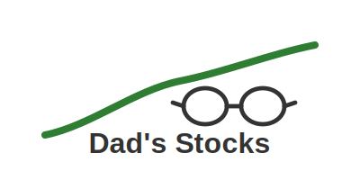

# Dad's Stocks


[](https://codecov.io/gh/gmoorevt/dadstocks)

A Flask-based web application that tracks real-time stock prices and their changes from the previous close. Built with love for Dad to keep track of his investments.



## Quick Start

```bash
# Clone the repository
git clone https://github.com/gmoorevt/dadstocks.git
cd dadstocks

# Start with Docker (recommended)
docker-compose up

# Access the application
open http://localhost:5001
```

See [Development](#development) section for more details.

## Features

- Real-time stock price tracking with simulation mode
- Historical price comparison
- News aggregation for tracked stocks
- Market index tracking (S&P 500, Dow Jones, NASDAQ)
- SQLite database for stock data persistence
- Clean and responsive web interface
- Admin dashboard for managing tracked stocks
- Docker support for easy deployment

## Technologies

- Python 3.9+
- Flask 3.0.0
- SQLAlchemy
- Alpaca Markets API
- TailwindCSS
- Chart.js
- Docker

## Development

### Prerequisites
- Docker and Docker Compose
- Python 3.9+ (for local development)
- Git

### Setup Options

#### 1. Using Docker (Recommended)
```bash
# Start the application
docker-compose up

# Access the application
open http://localhost:5001
```

#### 2. Local Development
```bash
# Create virtual environment
python -m venv venv
source venv/bin/activate  # On Windows: venv\Scripts\activate

# Install dependencies
pip install -r requirements.txt

# Setup environment
cp .env.example .env
# Edit .env with your settings

# Initialize database
python init_db.py

# Run the application
python app.py
```

### Development Features
- Live code reloading
- SQLite database persistence
- Simulation mode (no API keys needed)
- Comprehensive test suite
- Code coverage reporting

### Common Tasks

#### Running Tests
```bash
# In Docker
docker-compose exec web python -m pytest

# Local
python -m pytest
```

#### Database Management
```bash
# Access SQLite CLI
docker-compose exec web sqlite3 instance/stocks.db

# Reset Database
docker-compose down -v
docker-compose up
```

#### Viewing Logs
```bash
# Follow logs
docker-compose logs -f

# View specific service
docker-compose logs -f web
```

See [NOTES.md](NOTES.md) for more detailed commands and troubleshooting tips.

## Deployment

The application is automatically built and published as a Docker image to GitHub Container Registry on every push to the main branch.

### Production Deployment
```bash
# Pull the latest image
docker pull ghcr.io/gmoorevt/dadstocks:latest

# Run the container
docker run -p 5001:5001 -v data:/app/instance ghcr.io/gmoorevt/dadstocks:latest
```

### Environment Variables
```bash
# Required
ALPACA_API_KEY=your_api_key
ALPACA_SECRET_KEY=your_secret_key

# Optional
SIMULATION_MODE=false  # Set to true for development
FLASK_ENV=production  # Use 'development' for local
```

## Project Structure

```
├── app.py              # Main application file
├── models.py           # Database models
├── init_db.py          # Database initialization script
├── config.py           # Configuration settings
├── services/          # Service modules
│   ├── alpaca_factory.py    # Alpaca API service factory
│   └── mock_alpaca.py       # Mock service for simulation
├── templates/          # HTML templates
│   ├── base.html      # Base template
│   ├── index.html     # Dashboard template
│   └── news.html      # News page template
├── static/            # Static files (CSS, JS, images)
├── tests/             # Test suite
├── Dockerfile         # Docker build instructions
├── docker-compose.yml # Docker Compose configuration
└── requirements.txt   # Project dependencies
```

## Contributing

1. Fork the repository
2. Create a feature branch
3. Commit your changes
4. Push to the branch
5. Create a Pull Request

## Documentation

- [NOTES.md](NOTES.md) - Quick reference commands and troubleshooting
- [LICENSE](LICENSE) - MIT License information

## License

MIT License. See [LICENSE](LICENSE) for more information. 